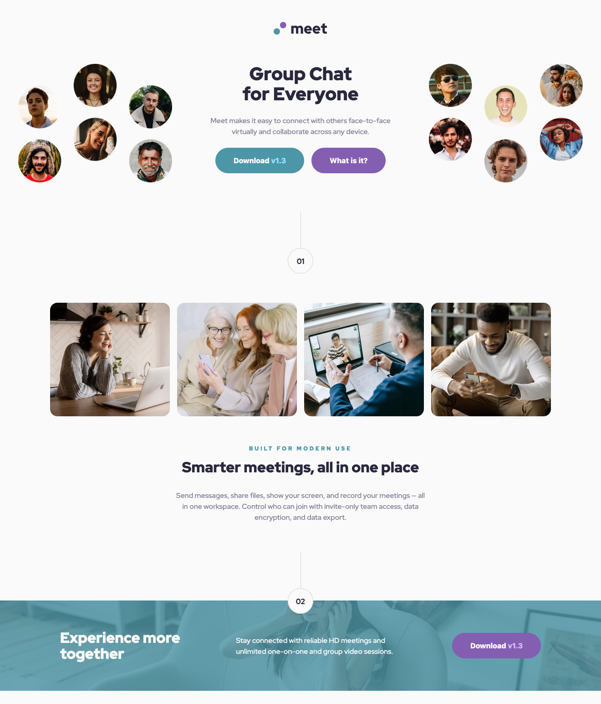

# Frontend Mentor - Meet landing page

This is a solution to the [Meet Landing Page challenge on Frontend Mentor](https://www.frontendmentor.io/challenges/meet-landing-page-rbTDS6OUR). Frontend Mentor challenges help you improve your coding skills by building realistic projects.

### Screenshot

### Links

- [Live Site](https://smills1020.github.io/frontend-mentor-meet-landing-page/)

### Built with

- Semantic HTML5 markup
- CSS custom properties
- Flexbox
- CSS Grid
